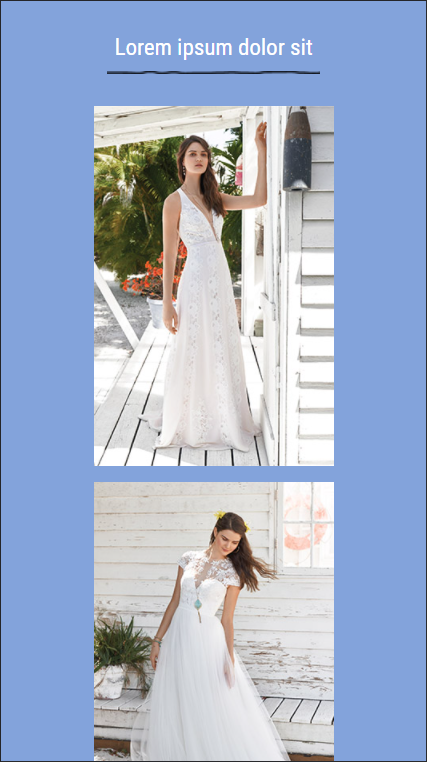
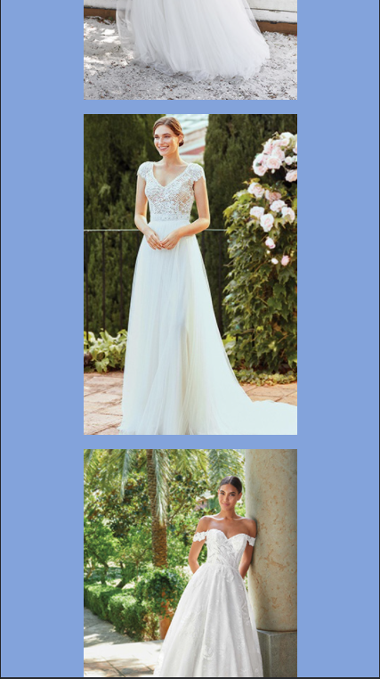
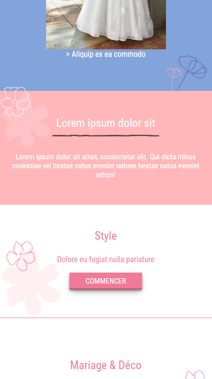
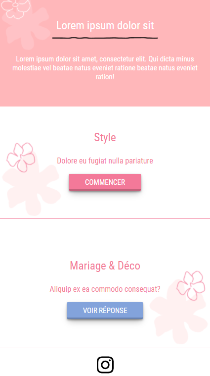
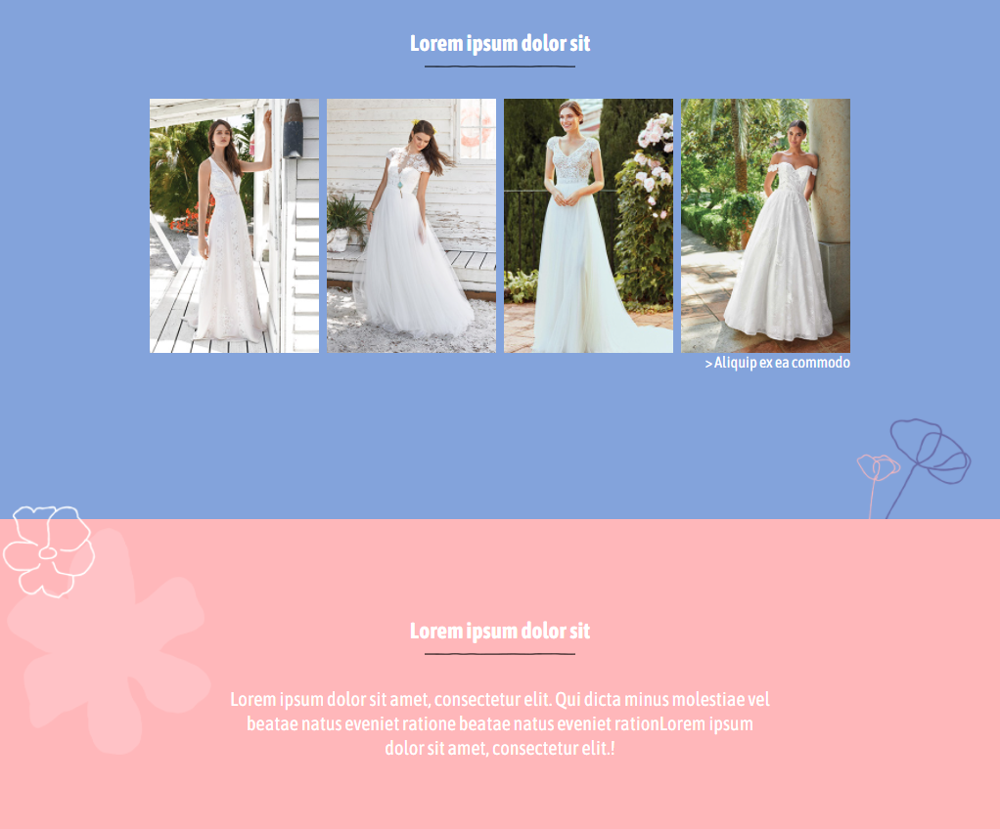
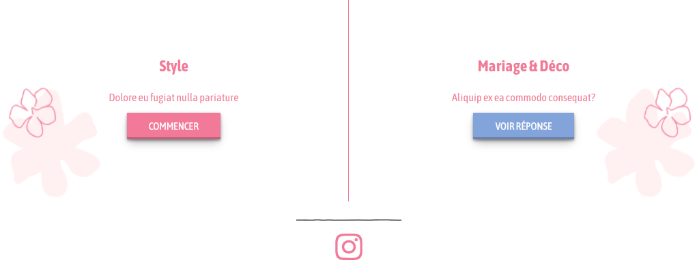

# Wedding -

## Table of contents

- [Overview](#overview)
  - [The task](#the-task)
  - [Screenshot](#screenshot)
  - [Links](#links)
- [My process](#my-process)
  - [Built with](#built-with)
  
- [Author](#author)
- [Acknowledgments](#acknowledgments)

### The task

Users should be able to:

- View the optimal layout depending on their device's screen size
- Ensure stable responsive design throughout all devices

### Screenshots
- Mobile :

- Desktop:

### Links

- Solution URL: [Github](https://github.com/aimdexter/weeding)
- Live Site URL: [Demo](https://aimdexter.github.io/weeding/page.html)

### Built with

- Semantic HTML5 (page.html)
- SASS source (style.scss)
- The compiled version of the SASS (style.css)
- Flex-box
- Grid
- Mobile-first workflow

## Author

- Website - [Bidbogs-prog] (https://bidbogs-prog.github.io/wedding-main/page.html)
- Frontend Mentor - [@Bidbogs-prog](https://www.frontendmentor.io/profile/Bidbogs-prog)

## Acknowledgments

Coded by <a href="https://github.com/Bidbogs-prog">Bidbogs-prog</a>.
